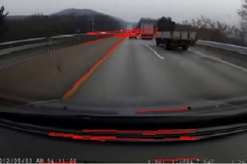

# 임베디드 시스템에서 이미지 인식을 활용한 고속도로 주정차 차량 인식 및 경고 시스템

본 저장소는 KSC2019 쏘카X한국정보과학회 AI 영상분석 경진대회에서 '전방주시안하는날까지'팀으로 내놓은 프로젝트이다. 
프로젝트는 CNN을 이용하여 실시간으로 블랙박스 영상에 대해 고속도로 불법 주정차 차량을 인식하고 또한 경고할 수 있는 시스템을 목표로 하였다.

경진대회 결과, 장려상을 수상하였다.

개요
---

##### 고속도로 정차 차량의 위험성과 인식 필요성

      

위 두 그래프에 나타나 있듯이, 고속도로 위 2차 사고 치사율 52.7%이며 일반 사고 치사율 9.1%의 5배이상이다.
그리고 고속도로 정차 차량은 뒤따르던 차량이 사고를 예측하지 못하고 대부분 2차 사고로 이어지는 경향이 있다.

다음은 실제 고속도로 정차 차량으로 인한 사고 상황이다.

위 상황은 고속도로 정차 차량을 발견하고 재빨리 운전대를 틀어 사고를 방지한 영상이다.

위 상황은 고속도로 정차 차량을 발견하고 급정거를 하였으나, 뒷차량이 제때 멈추지 못하고 사고가 난 상황이다.

위와 같은 상황에서 고속도로 위에서 정차 차량을 미리 인지할 수 있다면 사고를 줄일 수 있을 것이라 생각하여 프로젝트를 시작하였다.

# 알고리즘 측면
알고리즘을 간략하게 다음과 같다.

현재 나의 차선을 인식하여 내 차선 안에 있는 전방 차량을 트래킹한다. 
이후 앞차를 추적하면서 이전 프레임과 현재 프레임의 bounding box 크기 변화율을 구한다. 
bbox 크기 변화율을 통해 전방 차량과의 상대속도를 예측한다.

위 글을 나타내면 다음과 같다.
**1. 프레임 전체에 대해 차량 인식(CNN)**
**2. 차선 인식하여 현재 나의 차선 안에 있는 차량 인식**
**3. 지속적인 bbox 검출을 위한 트래커 사용**
**4. bbox 크기 변화율을 이용한 전방 차량과의 상대속도 예측**

---
좀 더 자세한 알고리즘은 다음과 같다.
### 차량 인식
임베디드에 적합한 yolo v3를 이용하여 프레임 전체에 대해 차량을 인식한다.

### 차선 인식
* Canny edge detection
프레임 전체에 대해 canny edge detection으로 에지를 검출한다.
* Hough transform
찾은 에지 중 차선이 될 수 있는 직선을 찾는다.
* Region of Interest
차선은 특정 각도 범위 내에 있으므로 False Positive lane을 제거한다.[1](reference1)
* 기울기 설정
구한 차선의 기울기를 이용하여 내 차를 기준으로 왼쪽 차선과 오른쪽 차선을 구분한다.
* 차선 업데이트
이전 프레임들에서 찾은 직선과 새로 들어온 직선간의 유사도를 파악하여 차선을 업데이트한다.
* 센터박스 구하기
위에서 구한 왼쪽 차선과 오른쪽 차선으로 소실점을 구한 후 센터박스를 만든다. 이 센터박스 안에 있는 차량이 전방 차량이다.

### 전방 차량과의 거리 측정

* 내 차선 안의 차량 여부
내 차선이 아닌 옆차선의 차량이 검출될 수 있다. 따라서 차선 안쪽에 차량인지 왼쪽 차선과 오른쪽 차선의 직선의 방정식을 이용하여 체크해준다.
* 차량 추적
차선 내부의 차량이 체크되었으면 이 차량을 추적하며 bbox 크기를 가져온다.
* bbox 크기 변화율
센터박스 내의 차량의 bbox 크기의 변화율을 측정한다.
Bbox 변화율 > bbox_threshold 이면, 전방 차량과의 거리가 전 프레임보다 가까워졌음을 의미한다.(alarm_count+1) 
alarm_count > alarm_threshold 이면 경고 메세지를 띄운다.

# 시스템 측면
프로젝트는 녹화된 블랙박스 영상에 대해서 진행했으나, 실제로 주정차 사고는 실시간으로 감지하여 예방해야 한다. 
좋은 성능을 가진 컴퓨터만이 가능한 알고리즘이라면 임베디드 시스템에는 부적절하다.
따라서 알고리즘을 실시간으로 구현할 수 있는지 여부가 중요하다.

다음과 같은 **CPU-GPU 파이프라이닝**을 통해 알고리즘을 실시간으로 구현하였다.

3개의 스레드가 각각 차선 인식, 차량 인식, 차량 추적을 맡았다.

# 테스트 결과

테스트는 다음 환경에서 진행되었다.
~~~
server
CPU : E5-2350
GPU : GTX 1080ti

NVIDIA AGX board
CPU : ARM v8.2 64-Bit CPU
GPU : Volta GPU + tensor core

Input : 1280 * 720 video
~~~

* 테스트 결과 영상

* 테스트 결과1 -server, pipelining X

|차선인식|차량인식|차량추적|FPS|
|---|---|---|---|
|7.4ms|+15.3ms|+16.7ms|44.1fps|

* 테스트 결과2 -server, pipelining O

|차선인식|차량인식|차량추적|FPS|
|---|---|---|---|
|7.4ms|15.3ms|16.7ms|**65.4fps**|

* 테스트 결과3 -AGX, pipelining X

|차선인식|차량인식|차량추적|FPS|
|---|---|---|---|
|26.6ms|+34.8ms|+52.4ms|44.1fps|

* 테스트 결과4 -AGX, pipelining O

|차선인식|차량인식|차량추적|FPS|
|---|---|---|---|
|26.6ms|34.8ms|52.4ms|**28.8fps**|

wpql2057@naver.com